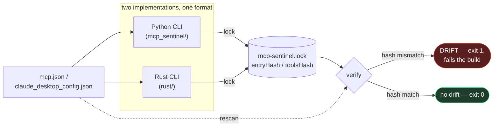

# mcp-sentinel

[](https://github.com/bharat3645/mcp-sentinel/actions/workflows/ci.yml)

Offline risk scanner **and lockfile** for [MCP](https://modelcontextprotocol.io)
(Model Context Protocol) client configs. Point it at a
`claude_desktop_config.json`, `.cursor/mcp.json`, `.vscode/mcp.json`, or any
file using the same `mcpServers` shape, and it:

- **`scan`** — grades every configured server A–F on concrete, explainable
  risk signals in how it's launched and configured.
- **`lock`** — pins every server (launch line, env var *names*, and
  optionally its tool schemas) to `mcp-sentinel.lock`.
- **`verify`** — fails CI when anything drifts from the lockfile. This is
  rug-pull detection: the attack that ships 15 clean versions and then
  silently changes a launch line or a tool description.

**Zero network calls. Zero third-party dependencies.** It only reads the
JSON file(s) you point it at — it never contacts a registry, never executes
the servers it's scanning, and never phones home. That's a deliberate design
choice: a tool meant to catch supply-chain risk shouldn't introduce its own.

## Why

MCP adoption has exploded through 2026 as the standard interoperability
layer between AI agents and tools, which also means MCP server configs are
now a real attack surface: floating `@latest` package pins that can change
silently, servers launched through a shell with obscured commands,
credentials pasted directly into config files, typosquatted package names —
and servers that were clean when you installed them and mutated later.
Most of that is invisible at a glance in a JSON file. `mcp-sentinel` makes
it visible, and the lockfile makes *changes* to it visible.

## Install

```bash
git clone https://github.com/bharat3645/mcp-sentinel.git
cd mcp-sentinel
pip install -e .
```

Requires Python 3.9+. No other dependencies.

### Rust CLI (single binary, no Python required)

`rust/` has a second implementation of the same `scan`/`lock`/`verify`
CLI — same subcommands, same JSON schema, same lockfile format:

```bash
cd rust
cargo build --release
./target/release/mcp-sentinel scan ../tests/fixtures/clean.json
```

**Lockfiles are interchangeable between the two implementations.** Pin
with the Python CLI, verify with the Rust binary, or vice versa — the
Rust canonical-JSON serializer reproduces Python's
`json.dumps(sort_keys=True, separators=(",", ":"), ensure_ascii=True)`
byte-for-byte (unicode escaping, key sorting, compact separators; see
`rust/src/canonical.rs`), so `entryHash`/`toolsHash` values match exactly
for the same input. The one documented exception: JSON integers are
already in canonical form and round-trip byte-exact, but a tool schema
containing a fractional/exponent number literal (e.g. `1.50` instead of
`1.5`) could in principle canonicalize slightly differently between
Rust's float formatting and Python's — not something realistic MCP tool
schemas (which use integers for `minLength`/`maxLength`/etc.) run into in
practice, but worth knowing if you hand-author unusual schemas.

The typosquat-similarity rule (`POSSIBLE_TYPOSQUAT`) is a from-scratch
Rust port of the Ratcliff/Obershelp algorithm behind Python's
`difflib.SequenceMatcher.ratio()`, differentially tested against the real
Python implementation across 3000 random string pairs plus every
known-package test case before being ported — see `rust/src/rules.rs`.

"Byte-compatible" is checked two ways in CI, not just asserted: frozen
hash vectors in `rust/src/lockfile.rs` (real values generated from the
real Python package, pinned so any drift in either canonicalizer's output
is caught immediately) *and* a live differential job
(`tests/cross_lang_diff.sh`) that runs both real CLIs against the same
fixtures on every push — including a `lock` with one implementation
followed by a `verify` with the other, in both directions — and fails the
build the moment they disagree, rather than only against a frozen
snapshot.



## Scan

```bash
# Scan a specific config file
mcp-sentinel scan ./mcp.json

# Scan common client config locations automatically (read-only, best-effort)
mcp-sentinel scan --auto

# Fail (non-zero exit) if any overall score is below 70 -- CI gate
mcp-sentinel scan ./mcp.json ./.cursor/mcp.json --fail-under 70
```

### What `scan` checks

| Rule | Severity | What it catches |
|---|---|---|
| `INLINE_SECRET` | critical | A live-looking credential (GitHub token, AWS key, Stripe key, Slack token, etc.) hardcoded directly in `env` instead of referenced via `${VAR}` |
| `LATEST_TAG` | high | Package pinned to `@latest`, so the code that runs can change without review |
| `SHELL_INDIRECTION` | high | Server launched via `bash -c` / `sh -c` / etc., which hides the real command |
| `SHELL_METACHARACTERS` | high | `;`, `&`, `\|`, or `` `$(...)` `` in the command/args, suggesting chained commands |
| `POSSIBLE_TYPOSQUAT` | high | Package name is a near-miss (80–99% similar) to a well-known MCP server package |
| `UNPINNED_VERSION` | medium | `npx`/`uvx`/`pipx` invocation with no version pin at all |
| `BROAD_FS_SCOPE` | medium | Filesystem server granted a root as broad as `/`, `~`, or `/etc` |
| `NO_PROVENANCE_NOTE` | info | No description/comment noting where the server came from |

Grading: each server starts at 100 and loses points per finding (critical
−25, high −15, medium −8, low −3, info −0), floored at 0. 90+ is an A, 75+ a
B, 60+ a C, 40+ a D, below that an F. The overall grade is the average
across all servers in the file.

## Lock & verify (drift / rug-pull detection)

```bash
# Pin every server in the config to mcp-sentinel.lock
mcp-sentinel lock ./mcp.json

# Also pin a server's tool schemas from a tools/list response you captured
# (e.g. from your client's logs or an MCP inspector). Repeatable.
mcp-sentinel lock ./mcp.json --tools github=./github-tools.json

# Later -- in CI, a pre-commit hook, or a cron job:
mcp-sentinel verify ./mcp.json --tools github=./github-tools.json
# exit 0 = no drift; exit 1 = drift (fails the build); exit 2 = error
```

Example drift output after a package version silently changed and a tool
description mutated:

```
DRIFT: mcp.json no longer matches mcp-sentinel.lock:

   [CRIT] args-changed: 'filesystem' launch args changed: [...@2.1.0...] -> [...@2.1.1...].
   [CRIT] tools-changed: 'github' tool schema drifted from the locked hash -- tool
          names, descriptions, or input schemas changed since you locked. This is
          the rug-pull shape: re-review before trusting.
```

### What goes in the lockfile (and what deliberately doesn't)

| Recorded | Not recorded |
|---|---|
| launch `command` + `args` | env var **values** — never stored, never hashed (a hash of a secret is an offline dictionary-attack target) |
| env var **names** (sorted) | anything fetched from the network — tool schemas are hashed from a JSON file *you* captured |
| canonical entry hash (`sha256:`) | |
| tool-schema hash per server (optional) | |

Drift severities: `command-changed` / `args-changed` / `tools-changed` →
critical · `env-keys-changed` / `server-added` → high · `server-removed` →
medium · tools capture with no pinned hash → info (re-run `lock`).

Tool-schema hashing is order- and wrapper-insensitive: it accepts a raw
`tools/list` response, a full JSON-RPC result, or a bare array, normalizes
each tool to `{name, description, inputSchema}`, and sorts by name — so
formatting changes don't produce false drift, but a single changed word in
a tool description does.

## What it deliberately does *not* do

- No network calls, ever — it won't hit npm/PyPI to check if a package
  actually exists or has known CVEs, and it won't query live MCP servers
  for their tools (you capture those; it hashes them).
- No execution of the scanned commands.
- No allowlist/denylist of "safe" MCP servers — the typosquat check is
  similarity-based, not a verdict.

## Development

```bash
python -m unittest discover -s tests -v
```

37 tests, stdlib `unittest` only (no `pytest` dependency required). CI runs
the suite on Python 3.9–3.13 plus a lock/verify dogfood roundtrip.

Rust port:

```bash
cd rust
cargo test --all-targets
cargo clippy --all-targets -- -D warnings
```

Unit tests per module (canonical JSON escaping, cross-language hash
vectors, typosquat-ratio vectors) plus integration tests that spawn the
compiled binary against `tests/fixtures/` and a full lock → verify →
tamper round-trip.

## Related projects by the same author

[`agent-rules-audit`](https://github.com/bharat3645/agent-rules-audit) —
scanner for poisoned agent instruction files (AGENTS.md, .cursorrules,
skills) | [`agent-tool-audit`](https://github.com/bharat3645/agent-tool-audit)
— grades MCP tool descriptions for injection-susceptible phrasing

## Contributing

Issues and PRs welcome, especially new heuristic rules — see
`mcp_sentinel/rules.py` for the pattern (a rule is just a function that
takes a server name and its config dict and returns a `Finding` or `None`).

## License

MIT — see [LICENSE](./LICENSE).
